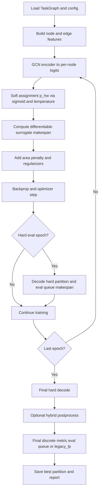
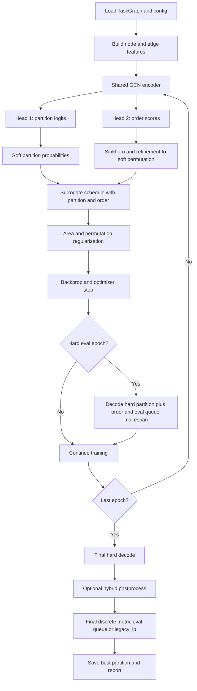

# Experiments Quickstart

This repo has multiple runnable scripts for MIP and GNN/heuristic sweeps. Below are the working commands and expected outputs.

## Environment
```bash
module load python/miniconda25.5.1
source /share/apps/python/miniconda25.5.1/etc/profile.d/conda.sh
conda activate combopt
export PYTHONNOUSERSITE=1
```

## MIP (single run)
```bash
./run_mip_local.sh
```
Outputs:
- Logs: `logs/run_milp_optimizer_area-<area>_hw-<hw>_seed-<seed>.log`
- Partitions: `makespan-opt-partitions/` or `makespan-mip-opt-partitions/` (see `solution-dir` in config), files like `taskgraph-...-assignment-mip.pkl`

## MIP sweep (all configs, local)
```bash
./run_mip.sh
```
This loops through all area/hw/seed configs in `configs/` and runs `milp_eval.py`.

## MIP + basic task-graph image
```bash
./run_mip_and_viz.sh
```
Outputs:
- Graph PNG: `Figs/hwsw/squeeze_net_tosa.png`

## MIP + partition overlay (HWSW utilities)
```bash
./run_mip_and_viz_hwsw.sh
```
Outputs:
- Partition overlay PNG: `Figs/hwsw/partition_overlay.png`

## GNN / heuristic single config
```bash
/people/dass304/.conda/envs/combopt/bin/python gnn_main.py -c configs/config_mkspan_default_gnn.yaml
```
To force specific methods:
```bash
HWSW_METHODS="random,greedy,diff_gnn,gl25" /people/dass304/.conda/envs/combopt/bin/python gnn_main.py -c configs/config_mkspan_default_gnn.yaml
```

## Fast simple differentiable (recommended)
Minimal config, fast defaults, MIP-style objective:
```bash
HWSW_METHODS="diff_gnn" \
/people/dass304/.conda/envs/combopt/bin/python gnn_main.py \
-c configs/config_fig3_taskgraph_gnn_fast_simple.yaml
```

Optional: include ordered variant and GL25 on the same Fig.3 case:
```bash
HWSW_METHODS="diff_gnn,diff_gnn_order,gl25" \
/people/dass304/.conda/envs/combopt/bin/python gnn_main.py \
-c configs/config_fig3_taskgraph_gnn_fast_simple.yaml
```

## GNN sweep
Default single config:
```bash
./run_all_gnn_configs.sh
```
All configs:
```bash
CONFIG_GLOB="configs/config_mkspan_area_*_hw_*_seed_*.yaml" ./run_all_gnn_configs.sh
```
With methods:
```bash
HWSW_METHODS="random,greedy,diff_gnn,gl25,shade,jade,esa,pso,dbpso,clpso,ccpso" \
CONFIG_GLOB="configs/config_mkspan_area_*_hw_*_seed_*.yaml" \
./run_all_gnn_configs.sh
```
Outputs:
- Logs: `outputs/logs/gnn_main_<config>.log`
- CSV summaries: `outputs/logs/<result-file-prefix>-result-summary-soda-graphs-config.csv`

```bash
HWSW_METHODS="random,greedy,diff_gnn,gl25,shade,jade,esa,pso,dbpso,clpso,ccpso" \
CONFIG_GLOB="configs/config_mkspan_default_gnn.yaml" \
./run_all_gnn_configs.sh

HWSW_METHODS="diff_gnn" \
CONFIG_GLOB="configs/config_mkspan_default_gnn.yaml" \
./run_all_gnn_configs.sh

```
Outputs:
- Logs: `outputs/logs/gnn_main_<config>.log`
- CSV summaries: `outputs/logs/<result-file-prefix>-result-summary-soda-graphs-config.csv`


## MIP sweep with logging + CSVs
Default single config:
```bash
./run_all_mip_configs.sh
```
All configs:
```bash
CONFIG_GLOB="configs/config_mkspan_area_*_hw_*_seed_*.yaml" ./run_all_mip_configs.sh
```
Outputs:
- Logs: `outputs/logs/mip_eval_<config>.log`
- CSV summaries: `outputs/logs/<result-file-prefix>-result-summary-soda-graphs-config.csv`


All configs:
```bash
CONFIG_GLOB="configs/config_mkspan_default_gnn.yaml" ./run_all_mip_configs.sh
```
Outputs:
- Logs: `outputs/logs/mip_eval_<config>.log`
- CSV summaries: `outputs/logs/<result-file-prefix>-result-summary-soda-graphs-config.csv`

## Direct MILP run (explicit config)
```bash
/people/dass304/.conda/envs/combopt/bin/python milp_eval.py -c configs/config_mkspan_default_gnn.yaml -t cvxpy
```

## Direct partition visualization
```bash
/people/dass304/.conda/envs/combopt/bin/python viz_hwsw_partition.py \
  --dot inputs/task_graph_topology/soda-benchmark-graphs/pytorch-graphs/squeeze_net_tosa.dot \
  --partition makespan-opt-partitions/taskgraph-...-assignment-mip.pkl \
  --out Figs/hwsw/partition_overlay.png
```


## Runn diff_gnn


```bash
cd hw-sw-partition-metaheur
CONFIG_GLOB="{configs/config_mkspan_area_0.7_hw_0.3_seed_3.yaml,configs/config_mkspan_area_0.5_hw_0.3_seed_3.yaml,configs/config_mkspan_area_0.5_hw_0.3_seed_1.yaml,configs/config_mkspan_area_0.5_hw_0.1_seed_3.yaml,configs/config_mkspan_area_0.5_hw_0.5_seed_1.yaml}" \
OUTDIR="outputs/test_diff_gnn" \
LOGDIR="outputs/logs_test_diff_gnn" \
CSV_OUT="outputs/test_diff_gnn/custom_diff_gnn.csv" \
./run_diff_gnn.sh
```

```bash
nohup env CONFIG_GLOB="configs/config_mkspan_area_*_hw_*_seed_*.yaml" ./run_diff_gnn.sh > diff_gnn.log 2>&1 &

nohup env CONFIG_GLOB="configs/config_mkspan_area_*_hw_*_seed_*.yaml" ./run_diff_gnn_order.sh > diff_gnn_order.log 2>&1 &

## Fig3 MIP-close profiles (legacy_lp metric)
Reference on this case (`paper_fig3_11node`, area `0.5`):
- MIP objective (`legacy_lp`): `26`
- MIP queue makespan: `29`

### Recommended profile (queue + MIP close)
```bash
cd /people/dass304/dass304/HWSWpartition/hw-sw-partition-metaheur
HWSW_METHODS="diff_gnn,diff_gnn_order" \
/people/dass304/.conda/envs/combopt/bin/python gnn_main.py \
-c configs/config_fig3_taskgraph_gnn_fast_simple.yaml
```
Observed:
- `diff_gnn_opt_cost=26`, `diff_gnn_makespan=31`
- `diff_gnn_order_opt_cost=26`, `diff_gnn_order_makespan=29`

### Objective-only profile (slower queue, still useful for ablation)
```bash
cd /people/dass304/dass304/HWSWpartition/hw-sw-partition-metaheur
HWSW_METHODS="diff_gnn,diff_gnn_order" \
/people/dass304/.conda/envs/combopt/bin/python gnn_main.py \
-c configs/config_fig3_taskgraph_gnn_mip_close.yaml
```
Observed:
- `diff_gnn_opt_cost=26`, `diff_gnn_makespan=39`
- `diff_gnn_order_opt_cost=26`, `diff_gnn_order_makespan=35`

## Simplified Mermaid pipelines
Diagram files:
- `figures/mermaid/diff_gnn_pipeline.mmd`
- `figures/mermaid/diff_gnn_order_pipeline.mmd`




```

```bash
HWSW_METHODS="diff_gnn,diff_gnn_order" /people/dass304/.conda/envs/combopt/bin/python gnn_main.py -c configs/config_mkspan_default_gnn.yaml

HWSW_RESULT_CSV="my_gpu_results.csv" \
HWSW_METHODS="diff_gnn,diff_gnn_order,gl25" \
CONFIG_GLOB="configs/config_mkspan_default_gnn.yaml configs/config_fig3_taskgraph_gnn.yaml" \
./run_all_gnn_configs.sh
```


HWSW_METHODS="diff_gnn,diff_gnn_order" /people/dass304/.conda/envs/combopt/bin/python gnn_main.py -c configs/config_mkspan_default_gnn.yaml

HWSW_METHODS="diff_gnn,diff_gnn_order" /people/dass304/.conda/envs/combopt/bin/python gnn_main.py -c configs/config_fig3_taskgraph_gnn.yaml


/people/dass304/.conda/envs/combopt/bin/python tools/visualize_schedule_from_partitions.py \
  --config configs/config_mkspan_default_gnn.yaml \
  --methods gl25,mip \
  --include-input true \
  --include-output true \
  --out-dir /people/dass304/dass304/HWSWpartition/hw-sw-partition-metaheur/outputs/final_visualizations/mkspan_default


nohup env CONFIG_GLOB="configs/config_mkspan_area_*_hw_*_seed_*.yaml" ./run_diff_gnn_order.sh > diff_gnn_order.log 2>&1 &
