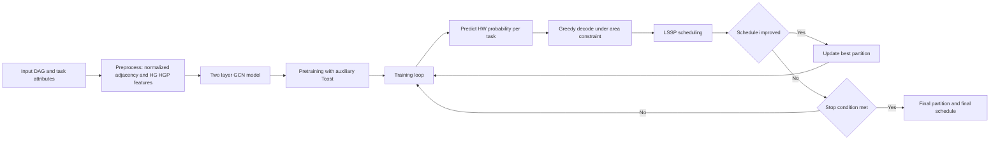
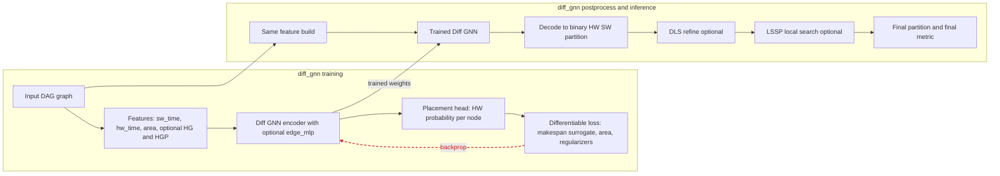
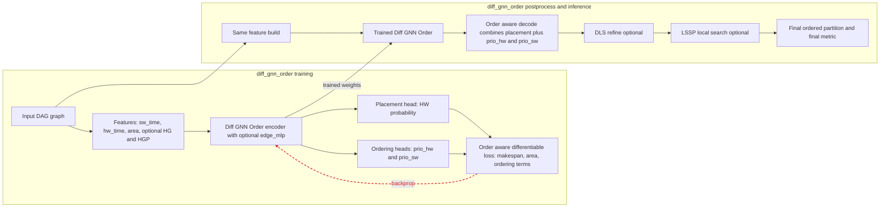
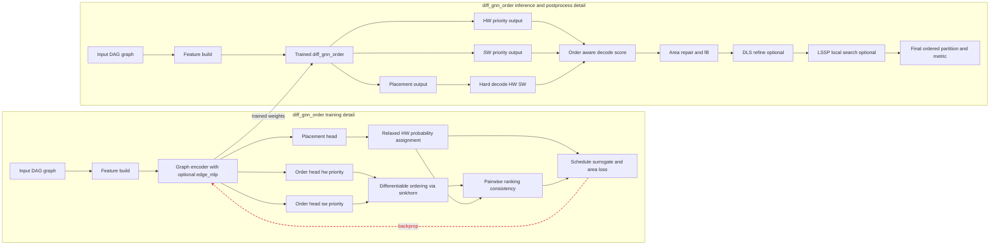

module load python/miniconda25.5.1
source /share/apps/python/miniconda25.5.1/etc/profile.d/conda.sh
conda activate combopt

cd /people/dass304/dass304/HWSWpartition/hw-sw-partition-metaheur/
cd /people/dass304/dass304/HWSWpartition/hw-sw-partitioning/

Current environments:
combopt              * /people/dass304/.conda/envs/combopt
py312                  /people/dass304/.conda/envs/py312
pygeo                  /people/dass304/.conda/envs/pygeo
base                   /share/apps/python/miniconda25.5.1

in HPC system:


Running: 


```bash
python meta_heuristic_main.py --config /people/dass304/dass304/HWSWpartition/hw-sw-partition-metaheur/configs/config_mkspan_default.yaml
```

```bash
python meta_heuristic_main.py --config /people/dass304/dass304/HWSWpartition/hw-sw-partition-metaheur/configs/config_mkspan_area_0.1_hw_0.1_seed_1.yaml

python gnn_main.py --config /people/dass304/dass304/HWSWpartition/hw-sw-partition-metaheur/configs/config_mkspan_area_0.1_hw_0.1_seed_1.yaml
```

```bash
python gnn_main.py --config /people/dass304/dass304/HWSWpartition/hw-sw-partition-metaheur/configs/config_mkspan_default.yaml

python gnn_main.py --config configs/config_mkspan_default.yaml

python gnn_main.py --config configs/config_mkspan_default_gnn.yaml
/people/dass304/.conda/envs/combopt/bin/python gnn_main.py --config configs/config_mkspan_default_gnn.yaml

```
`conda install -y pytorch=2.1.2 pytorch-cuda=11.8 -c pytorch -c nvidia`
`pip install torchvision torchaudio`

```python -c "import torch, torchvision, torchaudio; print(torch.__version__, torch.version.cuda, torchvision.__version__, torchaudio.__version__, torch.cuda.is_available())"```

Installed: ```2.6.0+cu124 12.4 0.21.0+cu124 2.6.0+cu124 True```

`pip install torch-geometric torch-scatter torch-sparse torch-cluster torch-spline-conv -f https://data.pyg.org/whl/torch-2.6.0+cu124.html`


## Run diff_gnn + diff_gnn_order and print visualization paths

```bash
HWSW_METHODS="diff_gnn,diff_gnn_order" /people/dass304/.conda/envs/combopt/bin/python gnn_main.py -c configs/config_mkspan_default_gnn.yaml

echo "[viz] saved under: outputs/final_visualizations/mkspan_default"
find outputs/final_visualizations/mkspan_default -type f -name "*.png" | sort

HWSW_METHODS="diff_gnn,diff_gnn_order" /people/dass304/.conda/envs/combopt/bin/python gnn_main.py -c configs/config_fig3_taskgraph_gnn.yaml

echo "[viz] saved under: outputs/final_visualizations/fig3"
find outputs/final_visualizations/fig3 -type f -name "*.png" | sort
```


# Mermaid diagram

## GCPS method ([https://link.springer.com/article/10.1007/s10617-021-09255-9])



## DIFF-GNN (without ordering)-ours



## DIFF-GNN-Order (with ordering)




## DIFF-GNN-Order (with ordering details)

